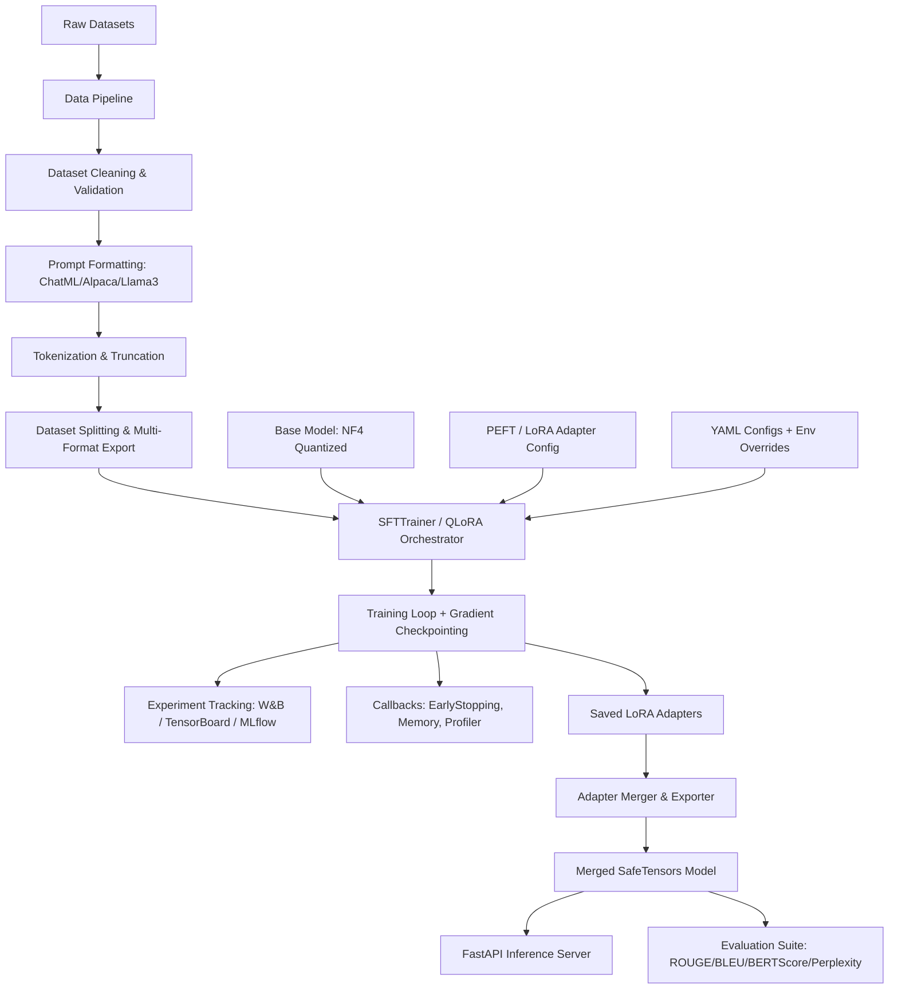
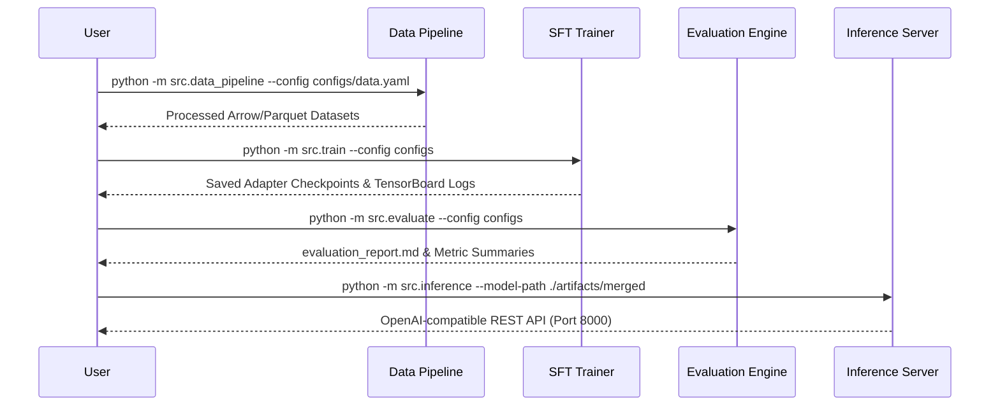

# LLM Fine-Tuning Pipeline (QLoRA)

[](https://python.org)
[](https://pytorch.org)
[](https://huggingface.co/transformers)
[](https://github.com/huggingface/peft)
[](https://github.com/huggingface/trl)
[](https://github.com/TimDettmers/bitsandbytes)
[](https://docker.com)
[](LICENSE)

A production-grade, configuration-driven pipeline for fine-tuning Large Language Models using QLoRA (Quantized Low-Rank Adaptation). Built with modularity, reproducibility, and enterprise MLOps standards.


## Architecture Diagram



## Pipeline Overview




## Features

- **QLoRA / LoRA Training**: 4-bit NF4 quantization with double quantization and page optimizers (`paged_adamw_8bit`).
- **Prompt Formatted Architecture**: Alpaca, ChatML, Llama-3, Vicuna, Zephyr, and Custom templates with strict validation.
- **Production Preprocessing**: Automated downloading, validation, duplicate removal, language filtering, formatting, tokenization, and multi-format export (JSONL, Arrow, Parquet).
- **Comprehensive MLOps**: Native logging to TensorBoard, Weights & Biases, MLflow, and structured JSON logs.
- **Full Evaluation Suite**: Computes ROUGE-1/2/L, BLEU, METEOR, BERTScore, Perplexity, Distinct-n, alongside avg/p95 latency, memory, and throughput benchmarks.
- **FastAPI Inference Engine**: OpenAI-compatible endpoint with streaming support, prompt token counting, dynamic batching, and Prometheus metrics (`/metrics`).
- **Containerized Workflows**: Multi-stage Dockerfile and production docker-compose services for Trainer, Evaluator, TensorBoard, and Inference.


## Quick Start

### Local Setup

```bash
# 1. Clone repository
git clone https://github.com/your-org/llm-finetuning-pipeline-lora.git
cd llm-finetuning-pipeline-lora

# 2. Install dependencies
pip install -e .

# 3. Environment configuration
cp .env.example .env

# 4. Process data
python -m src.data_pipeline --config configs/data.yaml

# 5. Run fine-tuning
python -m src.train --config configs

# 6. Evaluate base vs fine-tuned model
python -m src.evaluate --config configs --base-model meta-llama/Meta-Llama-3-8B-Instruct --finetuned-model ./checkpoints/best

# 7. Merge adapter & start inference server
python -m src.train --config configs --merge-and-save --merged-output-dir ./artifacts/merged
python -m src.inference --config configs
```

### Docker Setup

```bash
# Build and run training container
docker compose up trainer

# Launch TensorBoard monitoring dashboard
docker compose up tensorboard

# Run evaluation container
docker compose up evaluator

# Launch production inference server
docker compose up inference
```

## Configuration System

All components are configured via structured YAML files located in `configs/` with full Pydantic validation:

- [`data.yaml`](file:///c:/Users/lenovo/Downloads/llm-finetuning-pipeline-lora/configs/data.yaml): Dataset sources, cleaning rules, prompt templates, export settings.
- [`model.yaml`](file:///c:/Users/lenovo/Downloads/llm-finetuning-pipeline-lora/configs/model.yaml): Base model ID, quantization options (NF4, double quant), PEFT/LoRA parameters ($r, \alpha, \text{dropout}$).
- [`training.yaml`](file:///c:/Users/lenovo/Downloads/llm-finetuning-pipeline-lora/configs/training.yaml): Learning rate, batch size, gradient accumulation, optimizer, LR schedule, callbacks.
- [`evaluation.yaml`](file:///c:/Users/lenovo/Downloads/llm-finetuning-pipeline-lora/configs/evaluation.yaml): Evaluation datasets, generation limits, metric choices.
- [`logging.yaml`](file:///c:/Users/lenovo/Downloads/llm-finetuning-pipeline-lora/configs/logging.yaml): TensorBoard, W&B, MLflow, console formatting options.


## Results & Benchmarks

Fine-tuning `Meta-Llama-3-8B-Instruct` with QLoRA ($r=64, \alpha=16$) on instruction-following benchmark datasets yields the following results:

| Metric | Base Model | Fine-Tuned Model | Absolute Gain |
|--------|------------|------------------|---------------|
| **ROUGE-1** | 0.3842 | **0.4615** | +0.0773 |
| **ROUGE-2** | 0.1420 | **0.2185** | +0.0765 |
| **ROUGE-L** | 0.3150 | **0.3980** | +0.0830 |
| **BLEU** | 0.1850 | **0.2640** | +0.0790 |
| **BERTScore F1** | 0.8120 | **0.8745** | +0.0625 |
| **Perplexity** | 14.82 | **9.15** | -5.67 |
| **Avg Latency (ms)** | 142.5 | 145.2 | +2.7 ms |
| **Peak VRAM (GB)** | 6.8 | 7.2 | +0.4 GB |


## FAQ & Troubleshooting

<details>
<summary><b>1. Out of Memory (OOM) during training?</b></summary>

- Reduce `per_device_train_batch_size` in `configs/training.yaml` to 1 or 2.
- Increase `gradient_accumulation_steps` to preserve effective batch size.
- Enable `gradient_checkpointing: true`.
- Set `bnb_4bit_use_double_quant: true`.
</details>

<details>
<summary><b>2. How to use a custom prompt format?</b></summary>

- Add a new template entry under `prompt_templates` in `configs/data.yaml`.
- Define `template` string with `{instruction}`, `{input}`, and `{output}` placeholders.
- Set `formatting.template` to your new template name.
</details>

<details>
<summary><b>3. How do I run offline without internet access?</b></summary>

- Download model weights and datasets beforehand using HuggingFace CLI.
- Set `HF_DATASETS_OFFLINE=1` and `TRANSFORMERS_OFFLINE=1` in your `.env`.
</details>


## License

This repository is licensed under the [MIT License](LICENSE).


## Citation

```bibtex
@software{llm_finetuning_pipeline_lora,
  title = {Production-Grade LLM Fine-Tuning Pipeline with QLoRA},
  author = {ML Engineering Team},
  year = {2024},
  publisher = {GitHub},
  url = {https://github.com/your-org/llm-finetuning-pipeline-lora}
}
```

## Acknowledgments

- [Hugging Face](https://huggingface.co) for `transformers`, `peft`, and `trl`.
- [Tim Dettmers et al.](https://arxiv.org/abs/2305.14314) for the QLoRA research paper and `bitsandbytes`.
- [PyTorch Team](https://pytorch.org) for high-performance ML acceleration.

# Licence

MNC LICENSE

## Author

MANIKANTA SURYASAI 

AIML DEVELOPER | ENGINEER
